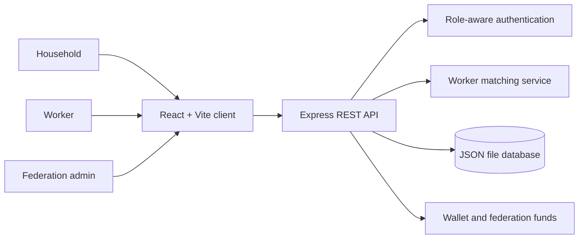

# Karya Sethu

> **A cooperative local-services platform that connects households with trusted workers and gives skilled workers a shared economic and social support system.**

Karya Sethu is a full-stack prototype for a fairer neighbourhood services marketplace. Households can find and book verified workers for everyday jobs. Workers can manage their availability, accept jobs, build earnings, and join a federation that provides collective welfare, transparent funds, and member support.

The project was built as a working multi-user application rather than a static demo. Open the household and worker experiences in separate browser windows to see bookings, job updates, payments, ratings, and federation activity move through the system.

## Why Karya Sethu?

Local service work is often fragmented: households struggle to find dependable help, while workers face irregular demand and have little access to collective protection. Karya Sethu brings both sides into one simple workflow:

```text
Household request -> Fair matching -> Worker completes job -> Payment is shared
                            -> Federation welfare funds
```

The platform is designed around three ideas:

- **Trust:** worker profiles, mock Aadhaar verification, ratings, and transparent job status.
- **Opportunity:** workers can control availability, receive nearby work, and build an in-app wallet.
- **Collective strength:** federations can approve members, manage welfare funds, resolve disputes, and publish announcements.

## Product Features

### For households

- Create an account and sign in with email or phone.
- Browse a fixed-rate service catalogue.
- Create a booking with task details and an optional image.
- Receive a worker matched using availability, profession, and distance.
- Review extra expenses and approve an estimate.
- Complete a mock UPI payment and rate the worker.
- Raise a dispute when a booking needs federation attention.

### For workers

- Create a worker profile with profession and experience.
- Complete mock Aadhaar verification.
- Switch between on-duty and off-duty status.
- Accept or decline incoming jobs.
- Add parts and other job expenses.
- Send estimates, start work, and mark jobs complete.
- Receive earnings in an in-app wallet.
- Join an existing federation or create one.

### For federation administrators

- Use the dedicated **Federation login** entry point.
- Review and approve worker join requests.
- See members, ratings, wallets, and duty status.
- Track welfare and maintenance funds.
- Disburse welfare support with a ledger entry.
- Publish federation announcements.
- Review and resolve worker or household disputes.

> Federation login uses the credentials of the worker who created the federation. This keeps the prototype compatible with the existing worker account while giving federation administration its own session and dashboard experience.

## Architecture



### Technology stack

| Layer | Technology |
| --- | --- |
| Frontend | React 18, React Router, Vite |
| UI | Tailwind CSS utility classes, Lucide icons |
| Backend | Node.js, Express 4 |
| Persistence | Local JSON file (`server/data.json`) |
| Authentication | Password hashing with Node `crypto.scryptSync` |
| API style | JSON REST endpoints |

## Repository Structure

```text
karya-sethu-fullstack/
├── client/
│   ├── src/
│   │   ├── components/       Shared navigation
│   │   ├── context/          Authentication state
│   │   ├── pages/             Household, worker, and federation screens
│   │   ├── api.js             Frontend API client
│   │   └── App.jsx            Routes and role protection
│   ├── package.json
│   └── vite.config.js
├── server/
│   ├── middleware/            Authentication middleware
│   ├── routes/                Auth, booking, worker, and federation APIs
│   ├── data.json              Local runtime database, ignored by Git
│   ├── matching.js            Worker matching logic
│   ├── services.js             Service catalogue
│   ├── db.js                  JSON database helpers
│   └── index.js               Express application entry point
├── .gitignore
└── README.md
```

## Getting Started

### Prerequisites

- Node.js 18 or newer
- npm

### 1. Install server dependencies

```bash
cd server
npm install
```

### 2. Start the API

```bash
npm run dev
```

The API runs at `http://localhost:4000` by default. You can change the port with `PORT`:

```powershell
$env:PORT=4001; npm run dev
```

### 3. Install and start the client

Open a second terminal from the repository root:

```bash
cd client
npm install
npm run dev
```

Open the Vite URL shown in the terminal, usually `http://localhost:5173`.

### Health check

Once the server is running, visit:

```text
http://localhost:4000/api/health
```

Expected response:

```json
{ "ok": true }
```

## Suggested Demo Flow

1. Create a **household** account in one browser window.
2. Create a **worker** account in another window.
3. Complete the worker profile and switch the worker to **on duty**.
4. Book a service from the household account.
5. Accept the incoming job from the worker account.
6. Add expenses, send an estimate, complete the job, and pay from the household account.
7. Rate the worker and inspect the worker wallet.
8. From the worker account, create a federation.
9. Log out and use **Federation login** with the federation admin worker's credentials.
10. Review members, funds, announcements, join requests, and disputes from the federation dashboard.

## API Overview

| Route group | Purpose |
| --- | --- |
| `/api/auth` | Signup, worker login, federation login, and current session |
| `/api/services` | Public service catalogue |
| `/api/bookings` | Create, track, estimate, pay, review, and dispute bookings |
| `/api/worker` | Worker profile, duty status, and job lifecycle |
| `/api/federations` | Federation creation, membership, funds, announcements, and disputes |
| `/api/health` | Server health check |

All protected requests use the prototype session token in the `Authorization` header:

```text
Authorization: Bearer <token>
```

## Data and Security Notes

This is a hackathon/demo prototype, not a production deployment.

- The JSON file database is useful for local demos and is intentionally ignored by Git.
- Authentication tokens are prototype-grade identifiers, not production JWTs or server-side sessions.
- Payments, Aadhaar verification, distance calculations, and matching are mocked or simplified.
- Uploaded images are held as base64 data in the JSON database.
- For production, use a real database, secure session or JWT handling, input validation, object storage, rate limiting, HTTPS, and a real payment provider.


